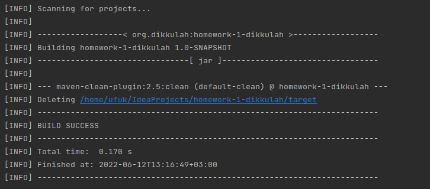
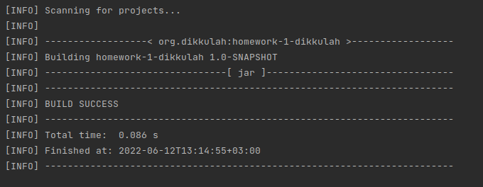
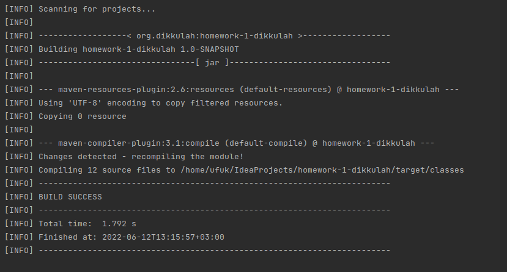
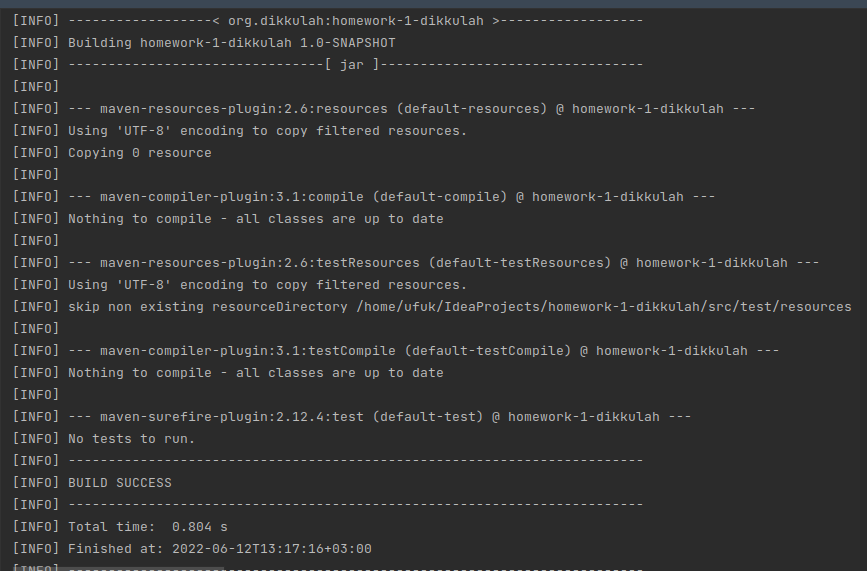
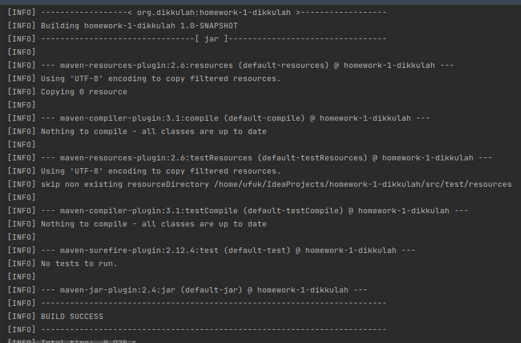
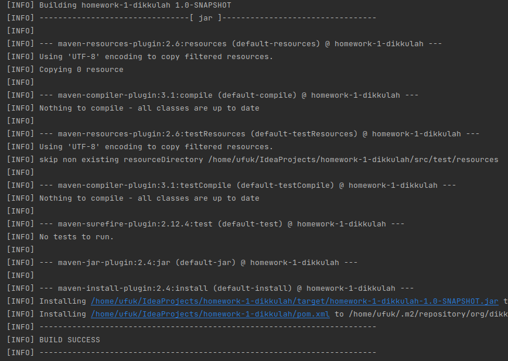
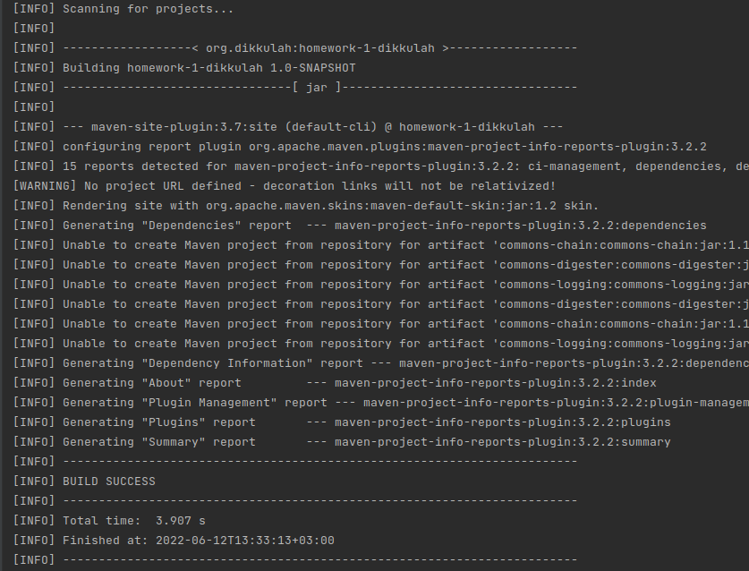
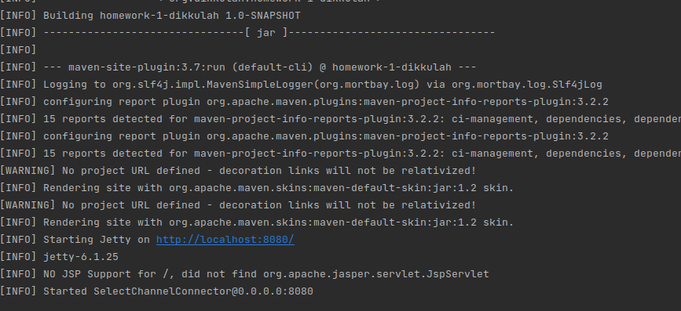

# Maven çıktısı:
1. mvn clean: proje derlenirken oluşan target klasörünü siler.
   
2. mvn validate : projenin target dosyasını siler ve hatalı kısımları tarar.
   
3. mvn compile :projeyi clean ve validate eder ardından derler.
   
4. mvn test : projeyi derler ve test sınıflarını çalıştırır.
   
5. mvn package : projenin testlerini yapar ve hata yok ise kodları paletler -> .jar
   
6. mvn verify projeyi paketler ve bu paketleri kontrol eder
   
7. mvn install projeyi doğruladıktan sonra yerel depoya yükler.
   
8. mvn deploy : projeyi uygulama sunucusuna gönderir
   -- uzak sunucu yok hata veriyor
9. mvn site  : projeye ait dökümantasyon üretir.
    1. site 
    2. site:run 

