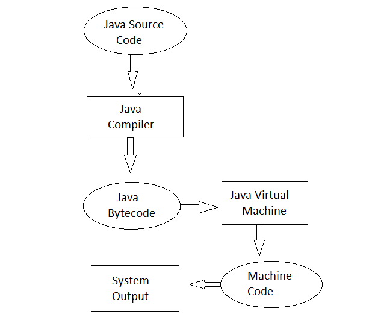
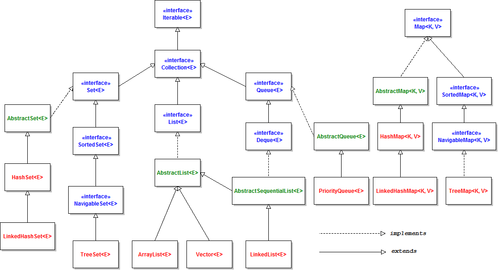

# Homework-1

1. Java’nın platform bağımsızlığını nasıl sağladığını anlatınız.(5 PUAN)
   1. Java JVM sayesinde platform bağımsızdır
   2. Java kodları derleyici(javac) tarafından bytecode adlı bir arakoda dönüştürülür.
   3. Bu arakodu platformların çalıştırması için JVM devreye girer ve bytecode'u platformun makine diline çevirir ve çalıştırır.
   4. 

2. Java neden çoklu kalıtımı desteklemez? Hangi diller bu duruma neden izin verir? (5 PUAN)
   1. Karmaşıklığı azaltmak ve dili basitleştirmek için bunu arayüzlerle sağlar
   2. Kalıtılan sınıflar içerisinde aynı isme sahip bir metot olabilir ve javac hangi yöntemi çağıracağına karar veremez ve belirsizlik oluşur.
3. Build Tool nedir? Java ekosistemindeki toollar neler?
   1. Temel olarak derleme otomasyonu denebilir, kaynak koddan yürütülebilir uygulamaların oluşturulmasını sağlar, proje büyüdüke bağımlılıkları arttıkça takip etmesi ve yönetmesi zorlaşır build toollar ile bu yönetimi sağlarız.
      1. Bağımlıkları yönetir.
      2. Kodu derler, paketler ve test eder.
      3. Kodu sunuculara dağıtır.
   2. Java eko sisteminde Ant, Gradle ve maven en popüler toolardır.
4. Collection framework içerisindeki
   yapıları örnekleyip açıklayınız. (20 PUAN)
   1. 

5. Bir müşterinin, sipariş oluşturup+, faturalarını kaydedebildiği+ ve görüntüleyebildiği+ bir uygulama
yazın.
Final+, static+, overload+, override+, constructor+, kalıtım+
polimorfizim+ , encapsulation+, List+, Set+, Map+ kavramlarını kullanılmalıdır.
Sisteme eklemeler yapabilirsiniz.
Main method üzerinde çalışması yeterlidir.
SOLID prensiplerine uygun olarak yazmaya çalışınız.
Kod kalitesi puanlanacaktır, isimlendirme kurallarına dikkat ediniz.
Listeleme işlemleri stream kullanılarak yapılmalı.(70 PUAN)

   1. Maven projesi oluşturun.+
   2. Maven komutlarını çalıştırıp, çıktıyı ekleyin +
   3. Tüm müşterileri listeleyin +
   4. Yeni Müşteri oluşturabilen +
   5. İçerisinde ‘C’ harfi olan müşterileri listeleyin +
   6. Haziran ayında kayıt olan müşterilerin faturalarınının toplam tutarını listeleyin +
   7. Sistemdeki tüm faturaları listeleyin +
   8. Sistemdeki 1500TL üstündeki faturaları listeleyin+
   9. Sistemdeki 1500TL üstündeki faturaları ortalamasını hesaplayın +
   10. Sistemdeki 500TL altındaki faturalara sahip müşterilerin isimleri listeleyin +
   11. Haziran ayını faturalarını ortalaması 750 altı olan firmalarının hangi sektörde olduğunu listeleyen kodu yazın.+

Bu dosya Patika.dev - LOGO Java & Spring Boot eğitimi dışında kullanılamaz.
Cem DIRMAN
